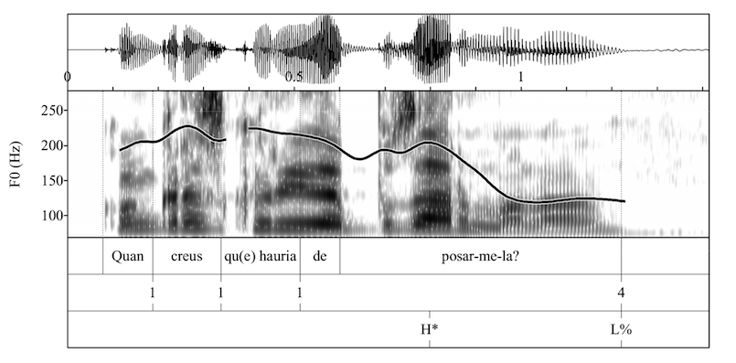
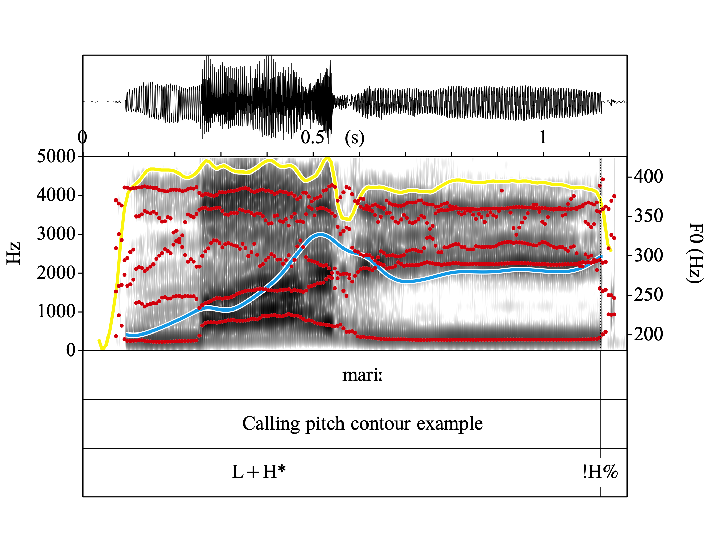

 
# Create Pictures
This folder contains a three scripts for creating a spectrogram figure (with or without annotation) of a sound file in Praat. Choose the script that serves your purpose better and download that .praat file.
- "create_pictures.praat": Creates pictures for all files in a folder
- "create-pictures-selected-sound.praat": Creates a picture for a selected sound, already open and selected at Praat (without annotation)
- " create-pictures-selected-sound-and-textgrid.praat": Creates a picture for a selected sound and TextGrid, both need to be already open and selected at Praat (with annotation)

> [!WARNING]  
> I am currently adapting the scripts to the new "To Pitch (filtered)" function, use the latest version of Praat to avoid errors. Also be aware that you migh use a pitch ceiling higher than usual if you set that manually.

# Output

# DESCRIPTION
 This script creates and saves pictures (PNG, PDF, wmf, eps, PraatPic) of all the Sound and TextGrid files it finds in a folder.
	
The pictures contain a waveform (optional), a spectrogram(optional), intensity track (optional), formant track (optional) and the F0 track (optional) and a the content of the tiers of the TextGrid associated with the sound file (optional). 
 
The script is designed to carry out some operations automatically:
	
1. If you are drawing a TextGrid, it recognizes automatically the number of tiers in EACH textgrid and draws the picture consequently (i.e. in the picture there will be no unnecessary white space between the tiers and the spectrogram). 
2. It converts the TextGrid to backslash trigraphs before drawing, so you won't have problems plotting symbols like % or ¡
3. It detects automatically the F0 range of the picture of EACH sentence (unless you choose to specify it manually). 
4. In order to correct those cases in which Praat detects F0 in fricatives (what Boersma calls "to hallucinate pitches") the script gets the pitch from a filtered sound in which all frequencies beyond 1000Hz have been cancelled. 
5. It establishes automatically the number of marks on the y axis and their placement. It places the first mark at the lowest multiple of 50 Hz within the range of the picture (e.g. at 50 Hz, or 100 Hz, or 150 Hz...). The following marks are placed every 50/100/150 Hz (depending on the range of the utterance).  
	
In the INSTRUCTIONS section you will find details about the other characteristics and options of the script (e.g changing the dynamic range, choosing the level of smooth in the F0 track, changing the axis' names, choosing the speakers range of F0...)
 	 

# INSTRUCTIONS
The specific instructions for each script are detailed at the beggining of the .praat file. Remember a Praat file is only a .txt file that you can open with your **plain** text editor (such as Notepad++, Sublimetext, Atom...)

# CREDITS
Feedback is always welcome, please if you notice any bugs or come up with anything that can improve this script, let me know!
Wendy Elvira-García
www.wendyelvira.ga
october 2013  
tested on Praat 6 for Windows and Mac  

**Citation: Elvira García, Wendy (2022). Create pictures with tiers v.6. Praat script.**

The first version of this script was inspired by:
draw-waveform-sgram-f0.praat  
Pauline Welby (2003) with the modifications made by Paolo Roseano (2011)  

# LICENSE
Copyright (C) 2017  Wendy Elvira  

This program is free software; you can redistribute it and/or modify it under the terms of the GNU General Public License as published by the Free Software Foundation; either version 3 of the License, or (at your option) any later version.

This program is distributed in the hope that it will be useful,
but WITHOUT ANY WARRANTY; without even the implied warranty of
MERCHANTABILITY or FITNESS FOR A PARTICULAR PURPOSE.  See the
GNU General Public License for more details.

You can find the terms of the GNU General Public License here
http://www.gnu.org/licenses/gpl-3.0.en.html

